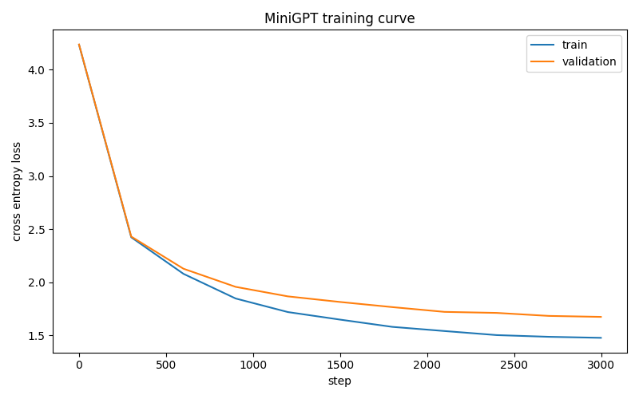
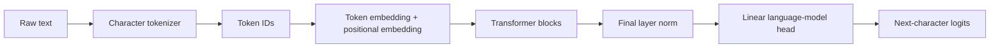

# MiniGPT

MiniGPT is a small GPT-style decoder-only transformer language model built from scratch in PyTorch. It includes character-level tokenization, causal self-attention, multi-head attention, transformer blocks, autoregressive training, checkpointing, and text generation.

This is a portfolio project designed to show practical understanding of how GPT-like language models work internally.

## Results

I trained a 3.21M parameter version on the Tiny Shakespeare dataset for 3,000 steps. Validation loss improved from `4.2369` to `1.6748`.



| Step | Train loss | Validation loss | LR |
| ---: | ---: | ---: | ---: |
| 0 | 4.2348 | 4.2369 | 1.50e-06 |
| 300 | 2.4233 | 2.4301 | 2.99e-04 |
| 600 | 2.0798 | 2.1278 | 2.87e-04 |
| 900 | 1.8476 | 1.9571 | 2.60e-04 |
| 1200 | 1.7201 | 1.8677 | 2.24e-04 |
| 1500 | 1.6490 | 1.8150 | 1.80e-04 |
| 1800 | 1.5809 | 1.7667 | 1.35e-04 |
| 2100 | 1.5417 | 1.7218 | 9.32e-05 |
| 2400 | 1.5034 | 1.7121 | 5.95e-05 |
| 2700 | 1.4873 | 1.6839 | 3.76e-05 |
| 2999 | 1.4778 | 1.6748 | 3.00e-05 |

Previous baseline: a 0.82M parameter model trained for 1,200 steps reached `2.0300` validation loss. The larger 3.21M parameter run reduced validation loss by about 17.5%.

Example generated text is available in [docs/sample_shakespeare.txt](docs/sample_shakespeare.txt). The output is intentionally imperfect because this is a small character-level model trained locally, but it learns Shakespeare-like structure, speaker names, line breaks, and word patterns.

## Features

- Character-level tokenizer
- Train/validation data split
- Causal masked self-attention
- Batched multi-head attention with a fused QKV projection
- GPT-style weight tying between token embeddings and output logits
- Feed-forward network
- Residual connections
- Layer normalization
- Dropout
- Autoregressive next-token training
- Linear warmup plus cosine learning-rate decay
- Best-validation checkpoint saving
- Temperature and top-k text generation
- Apple Silicon `mps` acceleration when available
- Metrics CSV and loss curve export

## Project Structure

```text
mini-gpt/
  README.md
  LICENSE
  requirements.txt
  assets/
    loss_curve.png
  data/
    shakespeare.txt
    tiny_sample.txt
  docs/
    metrics.csv
    sample_shakespeare.txt
  src/
    config.py
    dataset.py
    generate.py
    model.py
    train.py
  outputs/              # runtime-generated and ignored by Git
    best.pt
    checkpoint.pt
    loss_curve.png
    metrics.csv
    sample.txt
  notebooks/
```

## Setup

```bash
python3 -m venv .venv
source .venv/bin/activate
pip install -r requirements.txt
```

## Training Data

This repo includes:

- `data/tiny_sample.txt` for quick smoke tests
- `data/shakespeare.txt` for the portfolio training run

The Shakespeare dataset is public domain text commonly used for character-level language model experiments.

You can also train on your own plain text file by passing `--data path/to/file.txt`.

For copyrighted datasets, document the source and usage carefully before publishing results.

## Train

```bash
python src/train.py --data data/shakespeare.txt
```

For a quick smoke test:

```bash
python src/train.py --data data/tiny_sample.txt --max-iters 20 --block-size 32 --batch-size 4 --eval-iters 2
```

Command used for the included 3,000-step training result:

```bash
python src/train.py \
  --data data/shakespeare.txt \
  --max-iters 3000 \
  --block-size 128 \
  --batch-size 32 \
  --eval-iters 50 \
  --eval-interval 300 \
  --warmup-iters 200 \
  --min-lr 3e-5 \
  --n-embd 256 \
  --n-head 4 \
  --n-layer 4
```

The script automatically uses:

1. `mps` on Apple Silicon when available
2. `cuda` when available
3. CPU otherwise

## Generate Text

```bash
python src/generate.py --prompt "To be or not to be" --tokens 500
```

Generated text is written to:

```text
outputs/sample.txt
```

## Architecture



## How It Works

MiniGPT is trained to predict the next character in a sequence. For each input sequence, the target sequence is shifted one character to the right.

The model uses causal self-attention, which means each token can only attend to itself and earlier tokens. This prevents the model from seeing the future during training and matches how generation works at inference time.

The attention implementation uses one fused QKV projection and reshapes the result into separate heads. This is mathematically equivalent to running independent attention heads and concatenating them, but it is closer to production transformer implementations.

The language-model head shares weights with the token embedding table. This GPT-style weight tying reduces parameters because the same token-vector matrix is used for input embeddings and output logits.

Training uses linear warmup followed by cosine learning-rate decay. The trainer also writes `outputs/best.pt` whenever validation loss improves, while `outputs/checkpoint.pt` remains the final checkpoint from the end of training.

Each transformer block contains:

- layer normalization
- multi-head causal self-attention
- residual connection
- layer normalization
- feed-forward network
- residual connection

After training, the model generates text one token at a time by sampling from the probability distribution predicted for the next character.

## Portfolio Talking Points

- Implemented a decoder-only transformer from scratch in PyTorch.
- Built causal attention masking to enforce autoregressive generation.
- Added sampling controls with temperature and top-k filtering.
- Added warmup plus cosine LR scheduling and best-validation checkpointing.
- Used training and validation loss to evaluate model fit.
- Designed the project to run locally on Apple Silicon using PyTorch MPS.

## Limitations

This model is intentionally small. It learns patterns from the training text but does not have broad world knowledge, instruction-following ability, or the scale of production LLMs.

Possible improvements:

- Byte-pair encoding tokenizer
- Larger dataset
- Mixed precision training
- Weights & Biases experiment tracking
- Hugging Face model export
- Streamlit or Gradio demo UI

## License

This project is released under the [MIT License](LICENSE).
